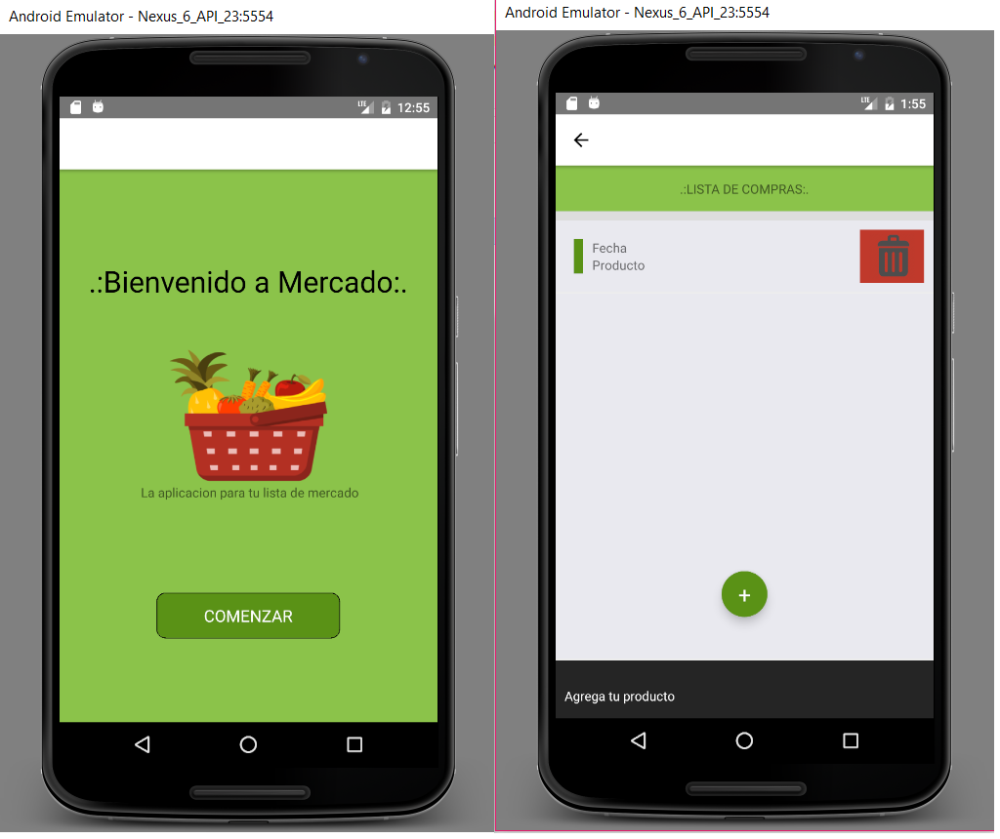

# Prueba React Native - LISTA MERCADO
Prueba realizada por [Daniel Alzate]

# Cómo se hizo para llegar al resultado:

Como no se contaba con experiencia previa en React Native, se siguieron las instrucciones disponibles en la documentación de https://facebook.github.io/react-native/ , esta ayudo a instalar y construir una aplicación base “HOLA MUNDO”, la cual se fue modificando hasta construir la app "Lista de mercado" y cumplir con las restricciones mencionadas en el documento “Prueba Técnica”.

Analizando la documentación, se entiende que react-native es un framework para construir aplicaciones multiplataforma con rendimiento nativo, para esta prueba se decide configurar el ambiente de desarrollo para android en sistemas operativos Windows.

Se inicio instalando las dependencias Node, Python2, JDK usando el administrador de paquetes Chocolatey. Al instalar node se instaló npm, con este se instala la Interfaz de línea de comando de React Native la cual permite ejecutar las directrices para inicializar el proyecto y posteriormente ejecutarlo en android.

Antes de ejecutar el proyecto fue necesario configurar el entorno de desarrollo Android, conformado por las Google APIs, el SDK 23 y un emulador de Android, lo cual se hizo con el IDE android studio.

Una vez terminada la configuración, se procedió a modificar la aplicación base. 

# Cómo ejecutar el proyecto:

# Herramienta usadas:
1. Atom
2. Android Virtual Divace de Android Studio  
3. Github Deskto

# Restricciones: 
1. Image
2. ScrollView  
3. Text 
4. View 
5. TextInput
6. TouchableOpacity / TouchableHighlight 

# Screenshot

